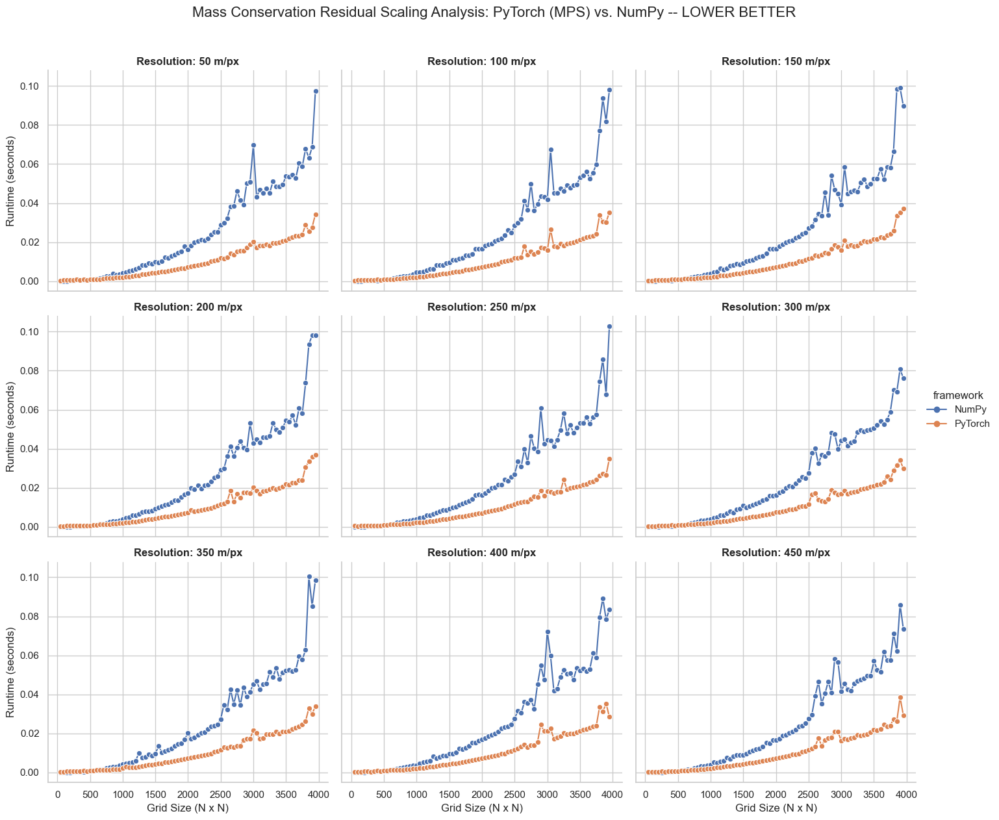
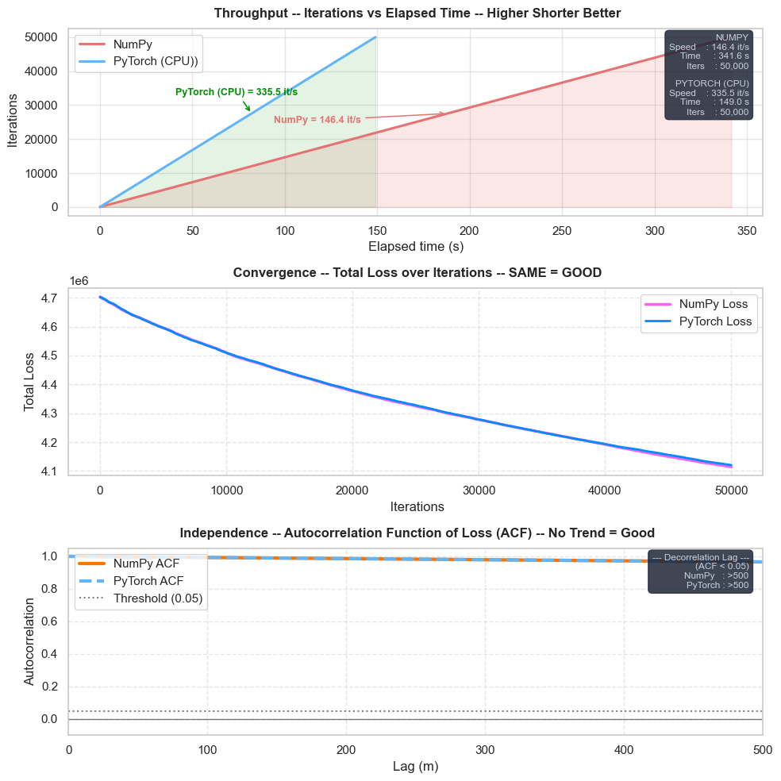
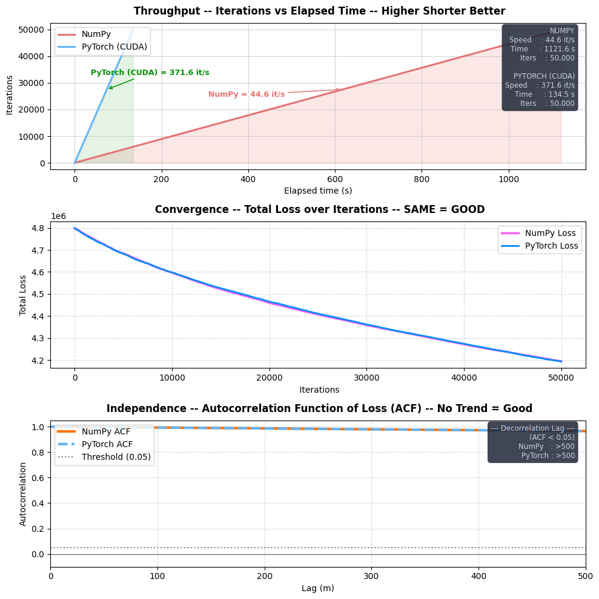

# GPU Acceleration for gstatsMCMC
This update introduces hardware-accelerated computation for MCMC.py and Topography.py. By migrating core calculations from NumPy to PyTorch, the package now leverages CUDA (NVIDIA GPUs) and MPS (Apple Silicon Metal Performance Shaders) for LargeScaleChain

# Overview
- Previously, gstatsMCMC relied on sequential CPU processing via NumPy. Operations such as spectral synthesis, gradient calculations, and mass conservation residuals are highly repetitive across thousands of MCMC iterations. This implementation shifts these bottlenecks to the GPU to take advantage of parallel processing.

- Replaces NumPy ndarrays with PyTorch Tensors to enable direct access to GPU cores and VRAM.

- Minimizes CPU-GPU synchronization (bottlenecks) by keeping intermediate calculations on-device.

# Changes

1. MCMC_gpu.py
- Introduce ` class chain_crf_gpu` subclass that inherits `chain_crf` class from MCMC.py . This preserves all original methods while overloading slow methods.
- A `_set_torch_device()` method automatically detects the best available hardware, prioritizing cuda > mps > cpu.

2. GPU/Pytorch Integration
- All numerical arrays are converted from NumPy to PyTorch tensors via a new `_to_tensor()` method, targeting CUDA, MPS (Apple Silicon), or CPU automatically via _set_torch_device()
- `_set_torch_device()` auto detects your hardware's device
- For example, if you have a Macbook w/ Mac Sillicon architecture (e.g. M2, M3,..), then `mps` is prioritized over `cpu`
- Cache arrays (loss_cache, bed_cache, resampled_times, etc.) are now pre-allocated as GPU tensors
and only transferred to NumPy at the very end of the run, minimizing CPU-GPU synchronization.
- A new `_loss_tensor()` method computes the loss entirely on-device without leaving the GPU.
- We avoid CPU-GPU synchronization because it requires memory allocation overhead that takes time -- milliseconds * n_iterations * `shape`

3. Spectral Field Generation
- A new `spectral_synthesis_field_torch()` function is added that performs FFT-based random field generation using PyTorch on GPU, as a replacement for the original NumPy-based spectral_synthesis_field().
- The NumPy RNG is deliberately kept for scalar parameter sampling to preserve reproducibility


# Testing

Hardware: 
- Mac M2 | supports MPS
- 8GB Memory
 
1. Mass Conservation Residual Calculation `tests\test_mcr_dtypes.py`
- Testing via tests/test_mcr_dtypes.py shows that as grid size ($N \times N$) increases, PyTorch on MPS significantly outperforms NumPy. While performance is comparable at small scales (N < 50), the GPU advantage grows substantially as $N$ approaches 4000.


2. LargeScale Chain
- Dataset: Bindschadler & MacAyeal Ice Stream data.

- Dimensions: ~2000x2000 grid at 500m resolution.

- Configuration: 50,000 iterations.



# Setting Up the Environment
1. Create and Activate Virtual Environment
```
# Create the environment
python -m venv .venv

# Activate (Windows)
.venv\Scripts\activate
# Activate (Mac/Linux)
source .venv/bin/activate
```
2. Install Dependencies
```
# CUDA GPUs
## Benefiticial to Google your compatible CUDA version and PyTorch version 
## change Torch version in requirements or .yml if it does not work for you

# Remaining requirements
pip install -r requirements
```

3. Test Single Chain
```
python benchmark_mcmc.py `
   --csv ../data/BindSchalder_Macayeal_IceStreams.csv ` # CHANGE THIS
   --sgs_bed ../sgs_beds/sgs_0_bindshadler_macayeal.txt ` # CHANGE THIS
   --n_iter 50000 `
# Read benchmark_mcmc.py for cmd instructions
```

4. Test Multiprocessing/Chains
```
# Change data paths before running
python largeScaleChain_multiprocessing.py
```

# Hardware verification

```
import torch
device = "cuda" if torch.cuda.is_available() else "mps" if torch.backends.mps.is_available() else "cpu"
print(f"gstatsMCMC will run on: {device.upper()}")
```

# Future Considerations

- Create a subclass for SmallScaleChain for PyTorch support
- Subclassing all new GPU related methods to avoid CPU-GPU synchronization, or Tensor to Numpy conversions

  
